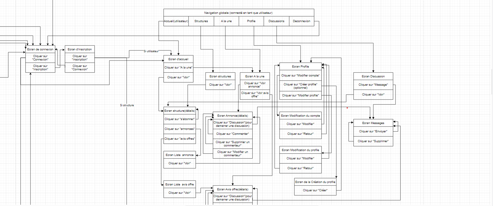
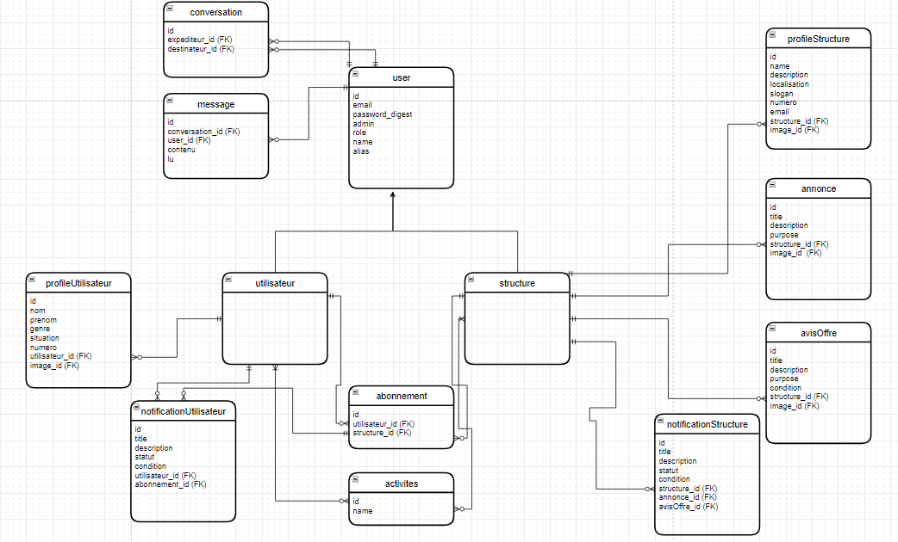

# Nidoops

## Qu'est ce Nidoops ?
"Nidoops" est une plateforme de mise en relation permettant aux utilisateurs d'échanger						avec les structures d'appuie au secteur privé, suivre l'actialités  des structures 							et pouvoir saisir les oportnuités à temps										
										

## Language de programmmation et Framework
* Ruby version
3.0.1
* Rails version
6.0.3

## How to run the website

``` 
git clone https://github.com/diaraba/projet_final_nidoops.git
 
cd nidoops

bundle install

yarn install --check-files

rails db:create && rails db:migrate
rails db:seed

rails s
```

## Catalog design and table definition
https://docs.google.com/spreadsheets/d/13eIEt9l90jQX3ND-4h4GPmfjf4Wcgq0MOJUENLpeLyA/edit?usp=sharing

## wireframe
https://www.figma.com/file/utFqCqdiMOVg3cKOfoRzH0/Projet-final-DIC?type=design&node-id=14%3A429&mode=design&t=pm1hYutESFUaie9y-1

## ER diagramm


## Screen transition diagram


## Vous avez là le lien pour accéder aux diagrammes ER et de transitions d'écrans
https://drive.google.com/file/d/1kr-jypE3tSrI91q4Yw5cuS8S9VuVrJs4/view?usp=sharing